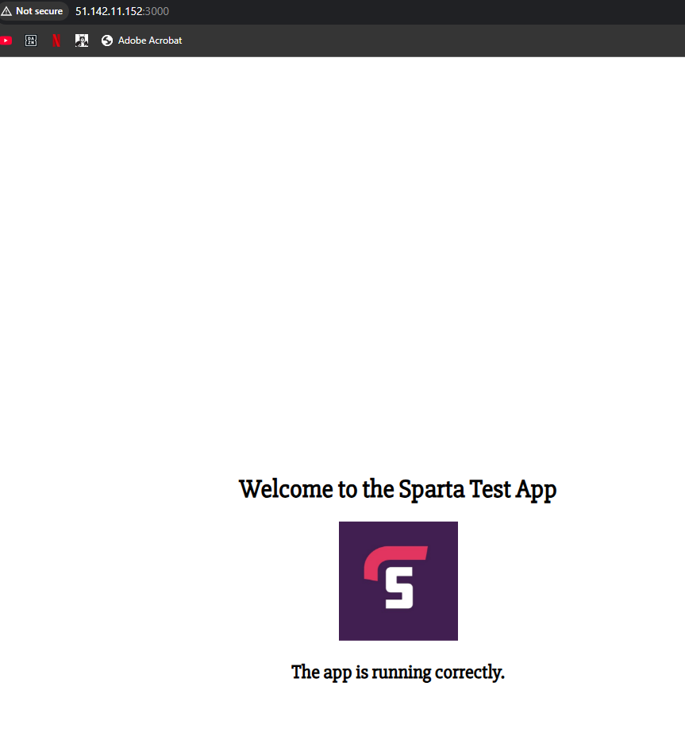

# Linux Processes and NodeJS App Deployment

### What is a Linux Process?
* A "Linux process" refers to an instance of a program that is currently running on a Linux system
* Uses resources, CPU
* Every process has a process ID
* Every process has a parent and child process
  * Parent processes are the housing process. They started the process
  * Child proccesses: A process within a process
  
 

* There are 2 types of Linux processes:
  * User
  * System
* Use command: 'ps' to see some User processes
* Use command: 'ps -aux' to see all User processes, including ID's, parent, and child processes 
* Use command: 'top' for processes to be seen in order of most CPU usage
  * Processes also refresh every 3 seconds
  * You can use 'shift + m' on this page to order in mem usage
  * 'shift + p' to revert back to CPU order
  * 'q' to go back to command prompt

 

* You can run processes in the background. 
* Use the 'sleep' command to demonstrate:
  * 'sleep' followed by how many seconds you want to sleep the terminal for
  * Use the '&' sign after the sleep command to run in background
    * E.g: 'sleep 50 &'
  * You can use the command 'jobs' to see what processes are running in the background
*  'kill' command can be used to end processes
*  'kill' has 3 stages 
   *  Gentle: 'kill -1' 
   *  Medium: 'kill'
   *  Strongest: 'kill -9'
* Most of the time, we won't need 'kill -9'
* to kill the 'sleep' process in the background before it expires itself, we can use the following:
  * 'ps' to find Process ID (2999)
  * 'kill -1 2999'
  * 'jobs'
    * If process cannot be found, then it has successfully been terminated
  
* Zombie Process:
  * A zombie process is a process that has finished executing but still has an entry in the process table, essentially remaining as a "dead" process that takes up system resources without actively doing anything 
  * Refers to when the parent process has been terminated, but the child process still remains 

### Deleting VM

* Stop VM on Azure portal
* Go on to Resource Tab
* Select resources that include VM
* Keep:
  * AZ Key
  * Subnet-VNET 
    * These are for future use

### How to deploy NodeJS App

**For later to deploy NodeJS App**

#!/bin/bash

#update software

sudo apt-get update -y

#upgrade

sudo apt-get upgrade -y

#install nginx

sudo apt install nginx -y

#check if running

sudo systemctl status nginx 

#install NodeJS pre-reqs

sudo DEBIAN_FRONTEND=noninteractive bash -c "curl -fsSL https://deb.nodesource.com/setup_20.x | bash -" && \
sudo DEBIAN_FRONTEND=noninteractive apt-get install -y nodejs

#check NodeJS version

node -v

#run app

node app.js OR npm start

#clone repo

git clone OR scp OR rsync 

### Copy NodeJS App to VM

By using the SCP method: 

* scp -i ~/.ssh/tech501-umar-az-key -r ~/nodejs20-sparta-test-app adminuser@51.142.11.152:/home/adminuser

By using git clone:

* Log into VM via SSH
* Check if git is installed:
  * git -v
* If not installed:
  * sudo apt install git -y
* Navigate to correct directory
  * Optional: Make one called repo with mkdir repo
* Clone repo:
  * git clone https://github.com/umarkhvn/tech501-week1.git
* Verify if installed:
  * ls
* Navigate to directory:
  * cd tech501-week2

### Test App

* Go into folder where package.json is located
* 'npm install' to install dependencies
* 'node app.js' to run app on port
* Test app by going on public IP followed by port number
  * In my case: http://51.142.11.152:3000/
* Ctrl + C to exit 

